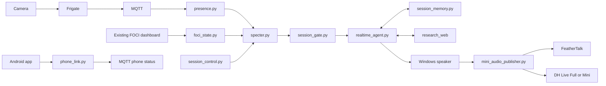

# Technical Guide

This is a source export of the working SpecterSaysHi system. The repository owner's narrative is in `README.md`; automated exports never create, edit, or remove that file. Runtime paths are preserved so the exported code keeps the same imports and resource lookups as the local system.

## System map



The phone bridge publishes state and supports phone commands; it does not currently start a Realtime conversation. Cat arrivals follow a separate identification and one-shot TTS path rather than a Realtime session or the avatar relay.

## Code ownership by subsystem

| Subsystem | Files | Responsibility |
| --- | --- | --- |
| Event generation | `frigate/config.example.yml`, `camera_bridge.ps1`, `presence.py`, `tiled_cat.py`, `foci_state.py` | Capture, detect, filter arrivals, evaluate sustained wearable states |
| Coordination | `specter.py`, `session_gate.py`, `session_control.py` | Route triggers and manage session occupancy |
| Conversation | `realtime_agent.py`, `foci_prompt.py`, `visual.py`, `echo.py` | Realtime voice, instructions, current still images, interruption and echo handling |
| Memory | `session_memory.py` | Summarize sessions, consolidate notes, load context for later conversations |
| Phone | `android-phone/`, `phone_link.py`, `setup_phone_link.ps1` | Android usage reports, pairing and pinned TLS |
| Avatar transport | `mini_audio_publisher.py` | Copy played 24 kHz PCM to the selected local backend |
| Avatar rendering | `feathertalk_lab/`, `dh_live_full/`, `dh_live_mini/` | Streaming inference, compositing, idle animation and speech-to-idle transitions |

`feathertalk_lab` contains production rendering code despite its name. Independent BitHuman and SyncTalk experiments are excluded from this export.

The avatar relay sends binary packets containing an eight-byte little-endian timestamp in milliseconds followed by mono signed 16-bit 24 kHz PCM. A JSON `reset` message discards pending speech after interruptions or reconnection. Avatar pages display frames; the Windows process plays the primary audio. Transport timestamps alone do not establish end-to-end audiovisual synchronization.

## Windows setup: voice and events

Requirements: Python compatible with `requirements.txt`, Docker Desktop with Linux containers, FFmpeg with DirectShow support, a camera, microphone and speaker. GPU avatar services require NVIDIA GPU access through Docker Desktop. The FOCI dashboard is an external input service and is not distributed here.

Run commands from the repository root:

```powershell
python -m venv .venv
.\.venv\Scripts\python.exe -m pip install -r requirements.txt
Copy-Item .env.example .env
Copy-Item config.example.env config.local.env
New-Item -ItemType Directory -Force frigate | Out-Null
Copy-Item frigate/config.example.yml frigate/config.yml
```

Edit `config.local.env`: set `SPECTER_TARGET_NAME` to your own exact Frigate Face Library name and choose microphone/speaker settings. Set `OPENAI_API_KEY` in your process environment or in `config.local.env` (both stay local). Set the Realtime model and voice there if desired. The root `.env` is loaded by Specter only for avatar settings; placing the API key there alone will not configure the voice process. `SPECTER_EXISTING_ENV` optionally reads API/model settings from a separate existing application; no EBO installation is required.

Start only the event services initially:

```powershell
docker compose up -d mediamtx mosquitto frigate
.\camera_bridge.ps1 -CameraName 'YOUR_DIRECTSHOW_CAMERA_NAME' -Ffmpeg 'YOUR_FFMPEG_EXECUTABLE_PATH'
```

The camera bridge runs in the foreground; use another PowerShell window for the listener. Match the capture dimensions with `frigate/config.yml`. Visit `https://127.0.0.1:8972` to configure face recognition; `docker compose logs frigate` supplies initial login information. The internal image API is at `http://127.0.0.1:15000`.

```powershell
.\.venv\Scripts\python.exe specter.py --dry-run
# After configuring and checking detection, run without --dry-run:
.\.venv\Scripts\python.exe specter.py
```

Dry-run still watches local event sources but skips opening conversations. It is not a full deployment test. Manual controls require the listener to be running:

```powershell
.\.venv\Scripts\python.exe session_control.py start
.\.venv\Scripts\python.exe session_control.py close
```

Examples disable FOCI, phone, cat announcements and avatar audio by default. Enable each after providing its inputs. Camera greeting is configured separately. The Windows task scripts assume existing scheduled tasks named `SpecterSaysHiCameraBridge` and `SpecterSaysHiVoiceListener`; they do not register those tasks. Foreground commands above work without those tasks. `camera_bridge.ps1` retains a machine-specific FFmpeg default from the working implementation, so pass your executable explicitly.

The optional `household_cats` Frigate classifier is disabled in the example because its trained resources are not included. Person/cat detection and face-recognition configuration remain available independently.

Do not run the full private deployment and this public snapshot simultaneously on the same machine: they share service names, ports, audio devices and task names. The public checkout is primarily the portfolio export; continue development and normal operation in the private checkout.

## Avatar setup and excluded resources

Source code is included; trained identities, original images, training clips, checkpoints and cached frames are not. A fresh clone does not contain a ready-to-run identity. Obtain upstream components under their licenses and supply your own assets.

| Backend | Included implementation | Local resources required |
| --- | --- | --- |
| FeatherTalk | `specter_server.py`, bounded realtime session, loop engine, resampler, detail and teeth filters, preparation/training scripts | Upstream checkout, audio/landmark weights, `data/base.jpg`, `data/base.lms`, `checkpoints/retrain_20260929/best.pth`, prepared `data/loop_base/` |
| DH Live Full | Server, reference preparation, full-frame display, idle and mouth restoration | DH model weights in `DH_live_From_baiduyun/checkpoint/`, prepared `dh_live_full/avatar/` |
| DH Live Mini | Audio inference service, independent image renderer and browser player | DH weights, detector/landmark weights, input video and prepared `dh_live_mini/assets/` |

Some training and resource paths retain dated names because they are the actual working implementation. These are local resource contracts, not included artifacts. FeatherTalk's `new` teeth mode additionally requires `data/teeth_20260930/`; `model_idle` requires matching `data/detail_balance/` assets and validates their hashes. The examples use `model` teeth and `original` detail until these optional caches exist.

### FeatherTalk

`feathertalk_lab/bootstrap.ps1` obtains the pinned upstream source and builds the base worker image. It does not acquire every model or prepare your identity. Check upstream instructions for their pretrained resources.

```powershell
.\feathertalk_lab\bootstrap.ps1
docker build -t feathertalk-lab:teeth -f feathertalk_lab/Dockerfile.teeth feathertalk_lab
```

Preparation scripts expect the documented `/work/data` paths mounted by the lab Compose file. `prepare.py` accepts source clip stems from `data/sources/`; `prepare_loop.py` expects a 25 fps `data/loop_base/idle.mp4`. Training scripts retain the original dataset/checkpoint assumptions. Inspect and adapt those inputs for your identity; they are not a general one-command training installer. Teeth and matched-idle scripts build optional local appearance assets.

When the required model and prepared identity resources exist, set `SPECTER_AVATAR_ENABLED=true` and `SPECTER_AVATAR_BACKEND=feathertalk` in `.env`, then:

```powershell
.\start_avatar.ps1
```

Realtime display: `http://127.0.0.1:18988/`. Loop preview: `http://127.0.0.1:18986/`. The production service shares one GPU engine between these pages and supports one inference session at a time. Fast/balanced/quality introduce 0/400/1000 ms of additional future context respectively; the longer settings do not guarantee better subjective quality.

### DH Live

The Dockerfiles fetch pinned upstream code. Models must be supplied locally; the directory name `DH_live_From_baiduyun` is retained as a mount contract. Mini preparation requires `scrfd_2.5g_kps.onnx` and `face_landmarker_256x256.pt` in `dh_live_mini/checkpoint/`; the asset builder also needs its DH model resources.

```powershell
docker compose --profile prepare run --rm dh-live-prepare
docker compose --profile prepare run --rm dh-live-prepare-assets
```

Place your reference clip at `dh_live_mini/input/reference.mp4` before preparation. Mini output is generated under `dh_live_mini/generated/reference/assets/` and must be copied into `dh_live_mini/assets/`. Full preparation uses frame-aligned mini intermediate data:

```powershell
docker compose --profile prepare run --rm dh-live-full-prepare
```

Select `SPECTER_AVATAR_BACKEND=dh_live` and `SPECTER_DH_LIVE_MODEL=full` or `mini`, supply the appropriate resources, enable avatar audio, and use `start_avatar.ps1`. Full display: `http://127.0.0.1:18890/`; Mini display: `http://127.0.0.1:18888/static/SpecterMini.html`. Full optional teeth/idle resources require their preparation scripts and matching avatar configuration.

## Prompts, memory, phone and diagnostics

Normal conversation instructions are in `realtime_agent.py:agent_instructions`; FOCI instructions and opening are in `foci_prompt.py`. They currently contain separate role definitions. Research instructions live in `make_research_tool`; memory writing and consolidation instructions live in `session_memory.py`.

Session summaries are written to local `memory/sessions.json`; consolidation writes `memory/long_term.json`. Transcripts used for summarization are retained in process memory. Camera snapshots, cat reference comparisons, conversation audio and summaries can be sent to the configured OpenAI services during operation. Neither local memory files nor references are distributed in this repository. Frigate recording and snapshots are disabled in the example.

Build `android-phone/` with an Android SDK, JDK 17 and Gradle compatible with its declared Android plugin. No Gradle wrapper or SDK binaries are distributed. `setup_phone_link.ps1 -Install` handles USB pairing after a debug APK exists; add `-Lan -HostIp <YOUR_COMPUTER_LAN_IP>` for pinned TLS on Wi-Fi. Runtime tokens/certificates are generated under ignored `private/`. Phone-side permissions include usage access and permission to run its monitor service; grant them through Android settings. `enable_phone_lan_firewall.ps1` contains the optional Windows firewall setup.

Logs are in ignored `logs/`. Sensitive transcript logging and SDK tracing are disabled in the example. Enable only deliberately for diagnostics. Cat image references are user-provided local files; the built-in category labels in code are not distributed photographs or trained classifier assets. Tiled cat detection requires local OpenVINO model files in ignored `models/`.

## Verification

```powershell
.\.venv\Scripts\python.exe -m pip install -r requirements-dev.txt
.\.venv\Scripts\python.exe -m pytest -q tests
```

The exported suite exercises event gates, session controls, memory, mocked Realtime behavior, audio routing, streaming history and transition geometry without loading a private identity. Unit-test results do not establish fresh-machine GPU deployment, live device behavior, visual quality, or end-to-end synchronization. Those require your own assets and integration checks.

## Updating the portfolio

The private project contains `publish_portfolio.ps1` and `portfolio/export-manifest.json`. Each manifest entry names one source and destination file. Directories are never recursively exported. Example configs and this guide are maintained in `portfolio/templates/`; the machine-local examples are never used as source.

1. Develop and test in the private project.
2. In the public checkout, run `git pull --ff-only` to obtain any GitHub README edits.
3. In the private project, run `pwsh -File .\publish_portfolio.ps1 -WhatIf` to validate, then run without `-WhatIf` to synchronize.
4. In the public checkout, review `git status` and `git diff`. For newly added files, use `git add .` followed by `git diff --cached` to see their full contents.
5. Commit and push from the public checkout.

```powershell
git add .
git diff --cached
git commit -m "Update portfolio implementation"
git push origin main
```

The exporter never commits or pushes. It protects `README.md`, rejects common credential/personal-path patterns before copying, and refuses to overwrite independently edited public files. `.portfolio-export.json` records hashes of managed files so removed allowlist entries can be cleaned up without deleting user-authored files. Pattern checks reduce accidental exposure; review diffs as well, since arbitrary sensitive text cannot be recognized perfectly.

The private Git history is not transferred. `.gitignore` is a second layer; the explicit manifest is the export boundary. Update the manifest deliberately when adding a module. For a conflict in an exported file, preserve its public edits and port the intended change back to the private source before exporting again. Author `README.md` directly on GitHub or in the public checkout.

Managed source text is exported with LF line endings and `.gitattributes` keeps them stable across Windows clones. README attributes retain the user's existing Git behavior. No executable or model bytes are exported.

## Third-party components

| Component | Source used by the integration |
| --- | --- |
| FeatherTalk | https://github.com/anliyuan/FeatherTalk at `ace1227ec0a367a983101bfc17d7e5fcf2bfb63f` |
| DH Live Full | https://github.com/kleinlee/DH_live at `8b74e3f73589339c0e5202ceea5b9a3afb4c3637` |
| DH Live Mini | https://github.com/kleinlee/DH_live at `4467e97cd97194c2c54762043cf121c6d313db12` |
| Frigate | https://github.com/blakeblackshear/frigate |
| OpenAI Agents SDK | https://github.com/openai/openai-agents-python |

Upstream repositories, weights and private identity assets are excluded. Fetch and use them under their own license terms; publishing integration source does not grant rights to those assets. This export does not select a new license on behalf of the repository owner.
